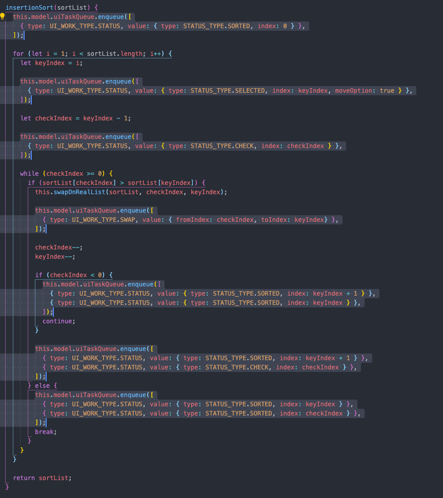
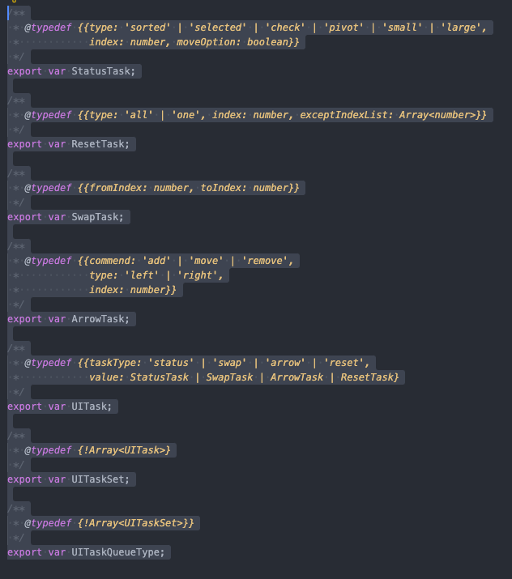
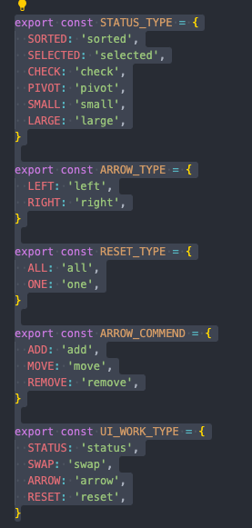
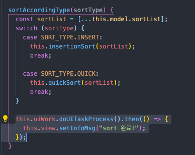
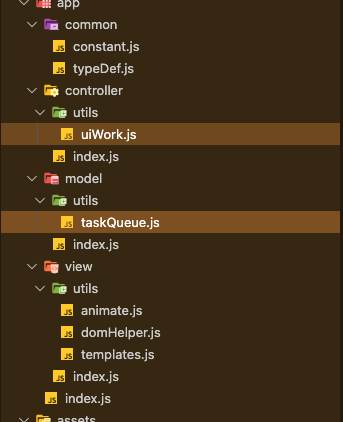
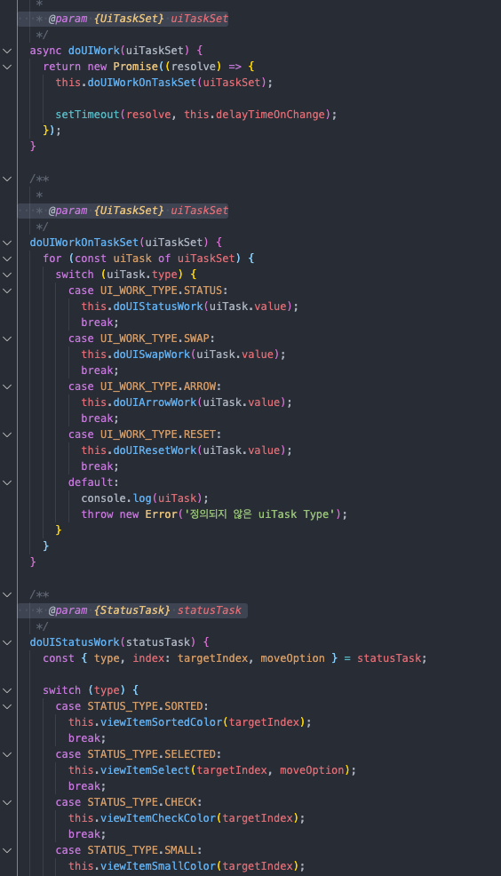

소팅을 향해 달려가자.

VisuAlgo 사이트를 모방한 HasuAlgo입니다!

시각화방식은 VisuAlgo 사이트를 많이 참고했으며 VisuAlgo사이트에서 불편한 점들을 개선하려고 노력하였습니다.
VisuAlgo 사이트 방식을 분석해서 사용하려다 보니 svg로 접근을 하게되었고, svg 문외한이었던 제가 조금이나마 svg와 친숙해질 수 있었던 시간이었습니다.

MVC패턴 적용하는것이 처음이라 많이 어려웠고 잘 짜여졌는지는 의문입니다.
또 과제 완료까지 리펙토링을 완료하려고 했는데 많이 복잡해진 것 같습니다ㅠㅠ 미리 리뷰에 힘드실 껏 같아 죄송합니다...

리뷰 잘 부탁드립니다~!!🙇‍♂️

### 시작 화면

### 선택정렬1

### 선택정렬2

### 퀵정렬1

### 퀵정렬2

## **리뷰 반영 이후 추가작업**

**목표** : sort 중에 ui 작업이 아닌, sort시에 ui를 위한 taskQueue를 만들어 ui작업과 sort작업을 분리
      (sort -> ui작업)

**과정** :
1. sort작업시 uiTaskQueue에 넣어주는 작업만 (controller/index.js)

    

2. uiTaskQueue에 대한 typeSafe 작업 (typeDef.js)

    

    

**개선사항** :  
1. controller는 sort와 ui작업이 분리되어 sort와 view에 바인딩되는 함수를 제외한 ui작업 함수를 uiWork.js로 옮겨 controller에 대한 코드분류로 가독성 향상

    

2. Model, Controller에 각각 Util로 코드분리

    

3. typeSafe한 코딩으로 함수 사용시 typeSafe 및 객체 사용성 향상 (인텔리센스)

    

